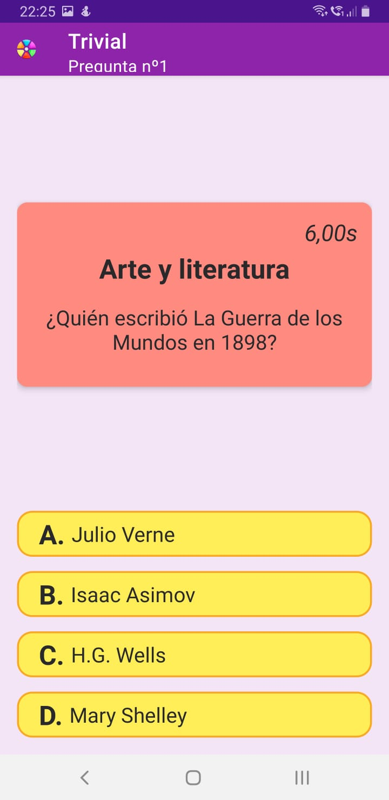
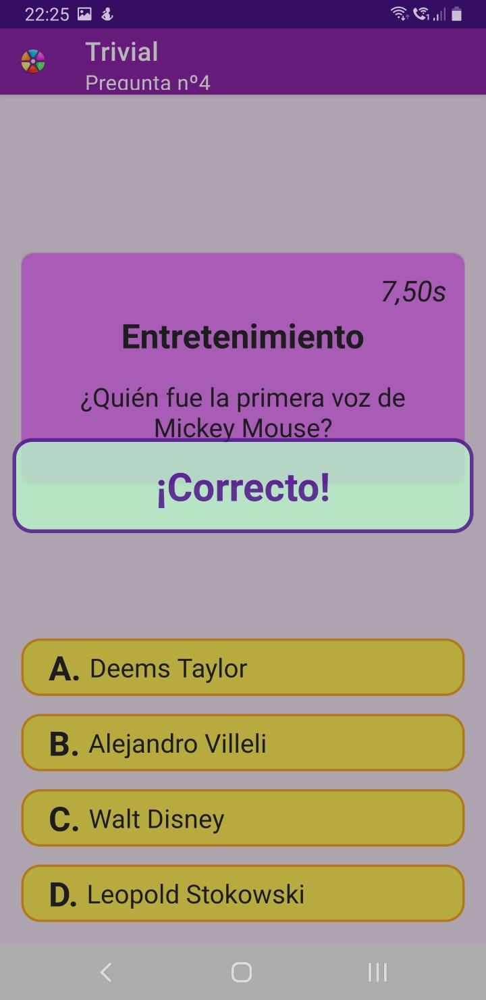
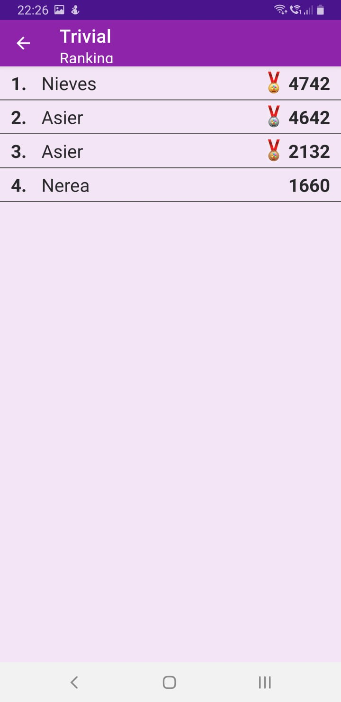

# Trivial

Trivial for Android is a quiz-type game with dozens of questions divided into six different categories (Geography, Art and Literature, History, Entertainment, Science and Nature, and Sports and Hobbies) and includes an embedded database that stores your best scores.

If you accept the challenge and want to try the app you can directly download the [apk file](trivial.apk)

## Screenshots

 

 

